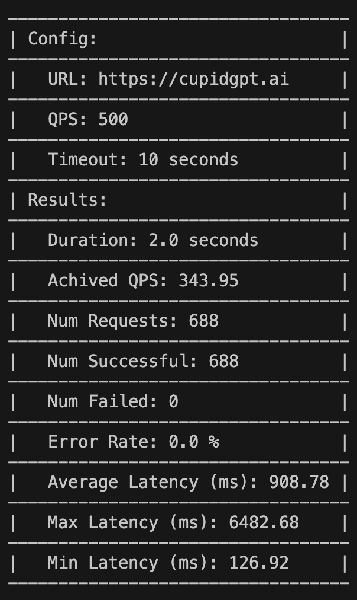

## About
HTTP load-testing and benchmarking library for testing the performance of a given URL. The library generates requests at a given fixed QPS and reports latencies, error rates, and common errors.


**Output Example:**
```bash
docker run -it --name http-benchmark --rm http-benchmark python http_benchmark.py --url fireworks.ai --qps 100 --timeout 20 --duration 10
```


## Setup

### Docker Setup
1. Start Docker Desktop/Docker Daemon \
Optional: [Install Docker Desktop](https://www.docker.com/get-started/)

2. Build Docker Image
```bash
docker build -t http-benchmark --rm .
```

3. Run Docker Image with default params
```bash
docker run -it --name http-benchmark --rm http-benchmark
```

4. Run Docker Image with custom params
```bash
docker run -it --name http-benchmark --rm http-benchmark python http_benchmark.py --url fireworks.ai --qps 100 --timeout 20 --duration 10
```

### Local Env Setup

1. Conda env setup
```bash
conda create -n http_testing python=3.11
conda activate http_testing
pip install -r requirements.txt
```

2. Usage
```bash
python http_benchmark.py --url fireworks.ai --qps 100 --timeout 20 --duration 10
```

## Usage Parameters
1. -u, --url: URL to test.
2. -q, --qps: Queries per second to send. Default 10
3. -t, --time: Timeout of HTTP/HTTPS request in seconds. Default 10
4. -d, --duration: Duration of the test in seconds. Default 10

## File Structure
1. `http_benchmark.py`: Main file to run the load testing and contains the HTTPBenchmark class
2. `Dockerfile`: Dockerfile to build the docker image

## By
- Author: Ranadeep Singh
- Email: ranadeep.dtu@gmail.com